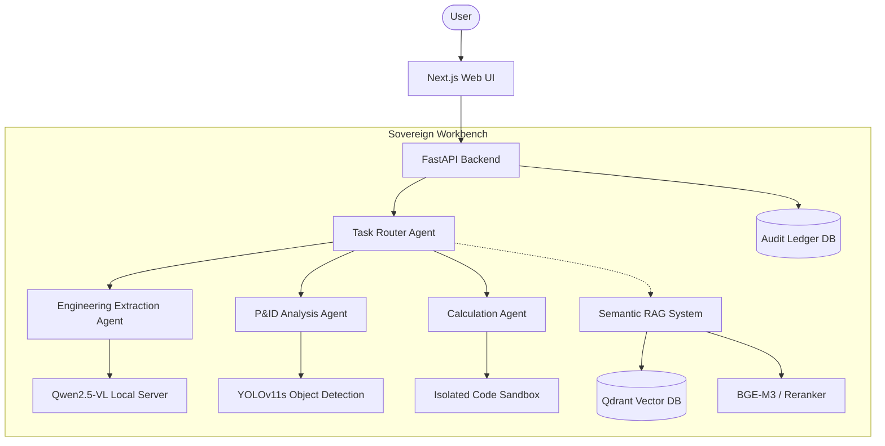
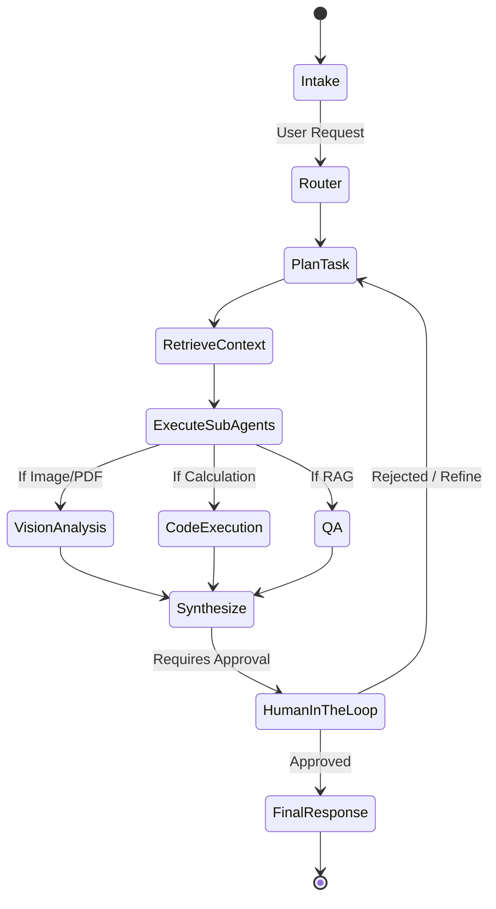

# Architecture

## System Overview

## Agent Graph Flow

## Component Descriptions
- **Next.js Web UI:** The frontend user interface supporting chat, file upload, and document preview.
- **FastAPI Backend:** The main API gateway managing requests, authenticating users, and streaming responses.
- **Task Router (LangGraph):** The core orchestrator state-machine. It decomposes requests into sub-tasks and assigns them to specialized tools.
- **Qwen2.5-VL:** A local Vision-Language Model handling OCR, diagram reading, and dense document synthesis.
- **YOLOv11s:** A fine-tuned CV model for specifically identifying engineering symbols (valves, pumps, etc.) in P&ID diagrams.
- **Qdrant & Embeddings:** BAAI's bge-m3 handles vectorization for local enterprise documents, while bge-reranker-large refines the search results for accuracy.
- **Code Sandbox:** An ephemeral Docker container used to safely run Python scripts generated by the LLM for calculations (e.g., blending optimization).

## Data Flow
1. User uploads a scanned engineering diagram and asks a question.
2. The UI sends a multipart request to the FastAPI backend.
3. The backend logs the request in the Audit Ledger.
4. The LangGraph state machine initializes. The router evaluates the request.
5. The image is passed to YOLO for symbol detection and Qwen for text/layout extraction.
6. The semantic search retrieves relevant MRPL standards from Qdrant.
7. The synthesis node combines the vision output and RAG context into a final answer.
8. The UI receives the streamed response and presents it to the user.

## Security Architecture
- **Complete Air-Gap:** No outbound internet requests exist within the application lifecycle.
- **Hash-Chained Audit Ledger:** All actions, inputs, outputs, and agent decisions are written to an SQLite database with cryptographic hashes (merkle tree structure) to ensure tamper-evident logging.
- **Strict Sandboxing:** Any dynamically generated code is executed in an isolated Docker network (`sovereign-sandbox`) lacking network bridges.
- **RBAC:** Integration with enterprise identity solutions to restrict actions based on user roles (e.g., Engineer, Supervisor).

## Deployment Topology
The system is built to be deployed on an internal enterprise server cluster using Docker Compose. All model weights and dependencies are bundled into the host machine, requiring no external registry pulls at runtime.
